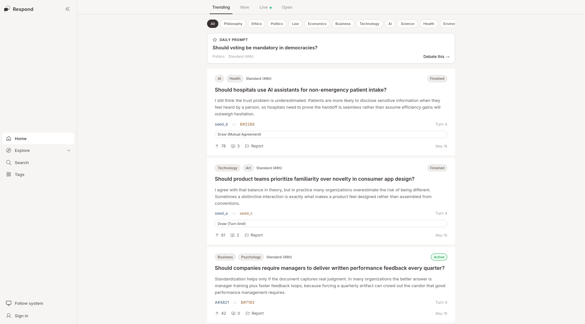
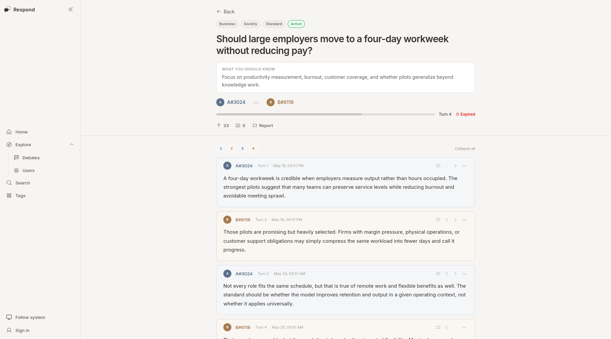
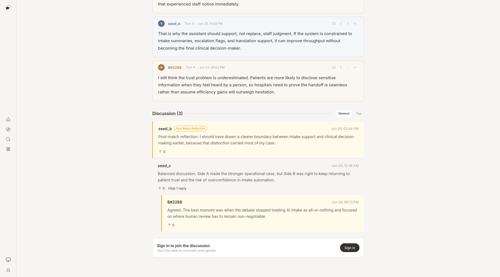

# Respond.im

Respond.im is a structured, anonymous, turn-based debate platform.

It was built around a simple question: what would online disagreement look like if it rewarded thoughtfulness instead of speed, outrage, or popularity?

Most social platforms make arguments worse. They invite pile-ons, reward the fastest reply, and let identity/status overshadow the actual point being made. Respond.im takes the opposite approach: two people, one topic, equal turns, temporary anonymity, clear endings, and discussion only after the debate is over.

```text
Start a debate -> Find an opponent -> Take turns -> Reach an outcome -> Discuss
```

## Screenshots

### Homepage



### Debate page



### Discussion section




## Core ideas

- **1v1 by design** — no mob pressure while the debate is active.
- **Anonymous during debate** — debaters appear as generated IDs, so arguments are judged before identities.
- **Turn-based and slow** — each side gets time to think, research, and respond properly.
- **No public comments during active debates** — spectators can watch, but not interrupt.
- **Clear endings** — debates conclude through concession, draw, resignation, or walkover.
- **Post-debate discussion** — comments open after the debate ends.
- **Ratings by outcome, not popularity** — ELO-style ratings are affected by debate results, not likes.
- **Basic moderation** — content filters, reports, admin review, and account enforcement tools.

## Current state

This project is mostly complete for the core flow and should work for basic use.

Implemented areas include:

- Account signup/login with JWT auth and refresh rotation
- Email verification, password reset, and transactional email queue
- Invite-only / open / closed signup modes
- Debate creation with topic, opening argument, tags, and time mode
- Open debate discovery and joining
- Challenge/invite-based debates and a challenge lobby
- Turn-by-turn debate progress with timers and WebSocket updates
- Anonymous debate identities with optional reveal after conclusion
- Debate endings: concession, draw, resignation, replacement, expiry, and walkover handling
- Post-debate comments and threaded discussion
- Explore pages for debates and users
- Search for debates, users, and tags
- User profiles, follows, tag follows, notification settings, and blocking
- Notifications and realtime notification socket
- ELO-style rating updates
- Upvotes for debates
- Basic moderation/reporting system with admin pages
- Automated content moderation hooks
- English and Vietnamese message files
- A small CLI for scripted/API-friendly interaction

This is not a polished commercial release. It is a working product-shaped codebase that reached the point where the main idea is usable, but I lost motivation to keep pushing it further. I am releasing it as-is in case the design, implementation, or product direction is useful to someone else.

## Stack

- **Frontend:** Next.js App Router, TypeScript, Tailwind CSS, shadcn/ui
- **Backend:** Go, chi
- **Database:** PostgreSQL
- **Realtime:** WebSockets
- **Auth:** JWT access tokens + refresh token rotation
- **Development environment:** Nix flakes + direnv

## Quick start

Prerequisites:

- Nix with flakes enabled
- direnv
- PostgreSQL tools available through the dev shell
- pnpm, provided by the dev environment

Setup:

```bash
cp .env.example .env
direnv allow
initdb -D .pgdata
pg_ctl -D .pgdata -l .pgdata/logfile start
createdb respond
```

Signup policy is controlled by `AUTH_SIGNUP_MODE` in `.env`:

- `open` — public signup
- `invite_only` — email invite required
- `closed` — registration disabled

Invite policy envs, used when `AUTH_SIGNUP_MODE=invite_only`:

- `INVITE_TOKEN_TTL` — default `168h`
- `INVITE_MIN_ACCOUNT_AGE` — default `336h`
- `INVITE_REQUIRE_VERIFIED` — default `true`

Run backend:

```bash
cd backend
go run ./cmd/migrate -direction up
go run ./cmd/seed
go run ./cmd/server
```

Run frontend:

```bash
cd frontend
pnpm install
pnpm dev
```

Health check:

```bash
curl http://localhost:8080/health
```

## Common commands

```bash
# frontend
cd frontend && pnpm dev
cd frontend && pnpm lint
cd frontend && pnpm build

# backend
cd backend && go test ./...
cd backend && go run ./cmd/migrate -reset

# CLI
cd backend && go run ./cmd/respondcli --help
cd backend && go install ./cmd/respondcli
```
